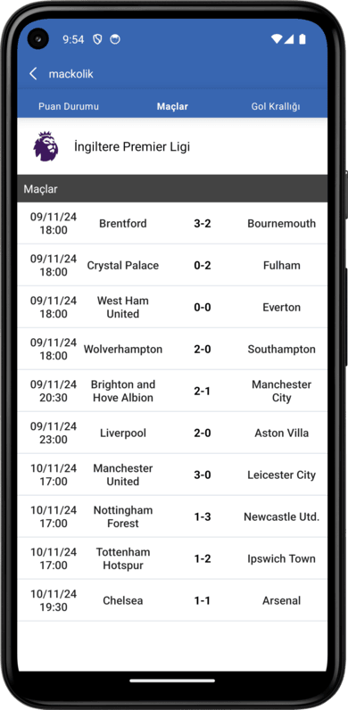

# MackolikClone

## Kullanılan Teknolojiler 
* Activity, Fragment, Navigation
* MVVM  
* RecyclerView  

**Projenin Amacı**  

*Büyük liglerin listesini , bu liglere ait puan durumunu, maç sonuçlarını ve gol krallığını getiren Kotlin dilinde MVVM(Model-View-ViewModel) mimarisi ile bireysel olarak geliştirdiğim projem.* 

